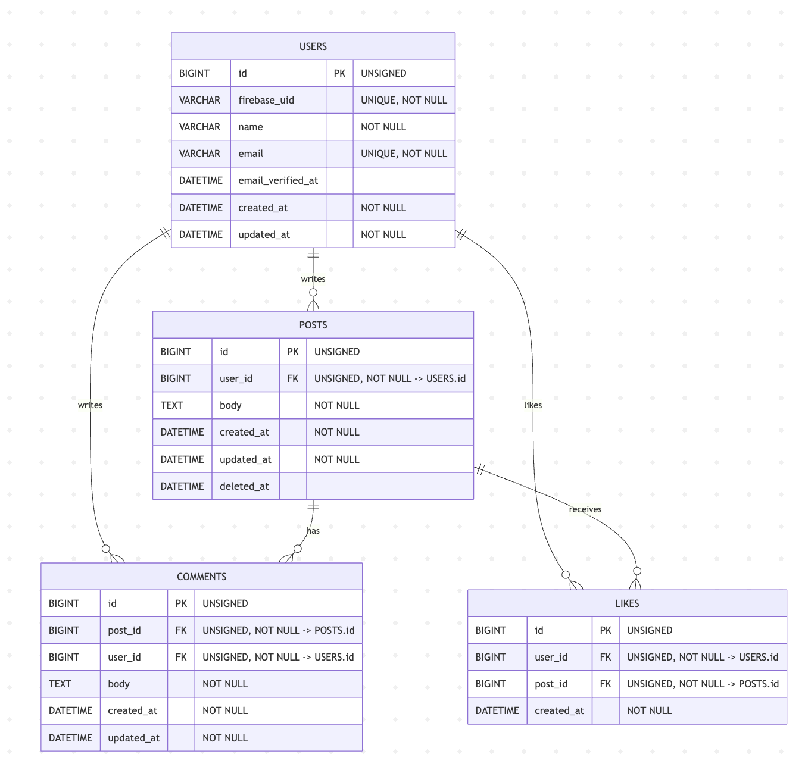

# アプリケーション名

SNSアプリ

-----

# 作成した目的

モダンなWeb開発技術の学習を目的として作成しました。


* **Laravel（バックエンド）+ Nuxt.js（フロントエンド）による分離アーキテクチャ**
* **認証システム**: Firebase Authenticationを利用した認証機能
* **クラウドインフラ**: AWS上でのスケーラブルなコンテナベースアプリケーションの構築
* **IaC実践**: Terraformによるインフラストラクチャの自動化と管理
* **CI/CD**: GitHub Actionsを用いた自動テスト・デプロイパイプライン
* **ECS Fargateを用いたサーバーレスコンテナ環境**
* **RDS（MySQL）とElastiCache（Redis）によるデータ層**
* **ALBによる高可用性**

-----

## アプリケーションURL
**本番環境**: https://app.smatsuoka.click/

### 重要事項

**フロントエンド（Vercel）**: 常時稼働中
**バックエンド（AWS）**: コスト最適化のため必要時のみ起動

AWS上のバックエンドサービス（ECS Fargate、RDS、ElastiCache、Nat Gateway等）は従量課金制のため、アプリケーションを閲覧する際のみリソースを立ち上げています。

### バックエンド起動手順
1. **デプロイ管理画面にアクセス**: https://app.smatsuoka.click/terraform
2. **「インフラ構築」ボタンをクリック**: Terraform Apply → テスト → Laravelデプロイが自動実行されます
3. **所要時間**: 約50分（インフラ構築からアプリケーション起動まで）

**アプリケーションを利用する場合は、閲覧予定時刻の50分前にデプロイ作業を開始してください。**

利用終了後は同じ管理画面から「インフラ削除」を実行し、AWSリソースの課金を停止できます。

-----


## 機能一覧

###  認証機能
* **ユーザー登録**: Firebase Authenticationによる新規アカウント作成
* **ログイン/サインアップ**: メールアドレス・パスワード認証

###  投稿機能
* **投稿作成**: テキスト投稿の新規作成
* **投稿一覧表示**: 全投稿のタイムライン表示
* **投稿詳細表示**: 個別投稿ページでの詳細表示
* **投稿削除**: 自分の投稿の削除

###  いいね機能
* **いいね追加/取消**: 投稿に対するいいねの追加・削除
* **いいね数表示**: リアルタイムでのいいね数カウント

###  コメント機能
* **コメント作成**: 投稿に対するコメント投稿
* **コメント一覧表示**: 投稿詳細ページでのコメント表示

---

## 使用技術(実行環境)

### バックエンド
* **PHP 8.2.28**
* **Laravel 11.31**
* **MySQL 8.0.37**
* **Redis 7.0.11**
* **nginx 1.21.1**

### フロントエンド
* **Nuxt.js 3.17.5**
* **Vue.js 3.5.17**
* **TypeScript 5.8.3**
* **Node.js 22.9.0**

### その他
* **Firebase Authentication**
* **Vitest** (フロントエンドテスト)
* **PHPUnit** (バックエンドテスト)

### インフラストラクチャ (AWS)
* **Terraform** - インフラ管理
* **ECS Fargate** - コンテナオーケストレーション (FARGATE_SPOT使用)
* **ECR** - コンテナレジストリ (nginx/php イメージ)
* **ALB** - Application Load Balancer (SSL/TLS終端)
* **RDS (MySQL 8.0)** - プライマリデータベース (db.t3.micro)
* **ElastiCache (Redis 6.x)** - セッションストア & キャッシュ (cache.t3.micro)
* **VPC** - プライベートネットワーク
* **NAT Gateway** - プライベートサブネットからの外部アクセス
* **Route53** - DNS管理
* **ACM** - SSL証明書管理
* **CloudWatch** - ログ・監視
* **S3** - ALBアクセスログ保存
* **Systems Manager** - 機密情報管理

---

## ER図



---

# 環境構築(ローカル環境)

-----

## セットアップ

### 1. リポジトリのクローン

まず、プロジェクトのリポジトリをローカルにクローンし、ディレクトリに移動します。

```bash
git clone git@github.com:matsuoka1985/afdafda.git
cd afdafda
```

### 2. Firebase 管理SDKの秘密鍵を配置

1. 別途連絡したFirebase Admin SDKの JSON内容を `afdafda/backend/storage/app/firebase/firebase-adminsdk.json` として保存。

### 3. Dockerコンテナの起動

```bash
docker compose up -d --build
```

### 4. PHPコンテナへアクセス

PHPコンテナのシェルに入るには、以下のコマンドを使用します。

```bash
docker compose exec php bash
```

### 5. 初期セットアップ

phpコンテナにログインした状態において以下のコマンドを実行することでcomposer installによるvendorディレクトリの作成、.envファイルの作成、APP_KEYの生成、マイグレーション、シーディングが一括で実行できます。
```bash
make setup
```


-----

## テスト

### 1. PHPUnitテスト（Laravel）の実行

```bash
# phpコンテナ内で実行
docker compose exec php php artisan test
```

### 2. Vitestテスト（Nuxt.js）の実行

```bash
# nuxtコンテナ内で実行
docker compose exec nuxt npm run test
```

-----

## アクセス情報

全てのコンテナが起動し、アプリケーションのセットアップが完了すると、以下のURLで各サービスにアクセスできます。

* **Nuxt.js フロントエンド**: [http://localhost:3000](http://localhost:3000)
* **Laravel API**: [http://localhost:80](http://localhost:80)
* **phpMyAdmin (データベース管理GUIツール UI)**: [http://localhost:8080](http://localhost:8080)
* **Redis**: [localhost:6379](localhost:6379)

### テスト用アカウント情報

以下の認証データによってテストアカウントでログインできます：

- **メールアドレス**: `dev@invalid.test`
- **パスワード**: `password`

---
